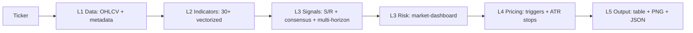

# margin-ta

Read-only technical-analysis pipeline — generate multi-horizon stances with indicator consensus, tiered S/R and market/sector risk dashboard.

[한국어](README.ko.md)

[](https://github.com/ianlyoo/margin-ta/actions/workflows/ci.yml)
[](LICENSE)
[](https://github.com/ianlyoo/margin-ta/releases/tag/v3.0.0)
[](https://ianlyoo.github.io/margin-ta/)

Read-only technical-analysis for US and Korean equities and crypto pairs. Combines 30+ vectorized indicators, multi-horizon daily/weekly/monthly stances, indicator-consensus layer, tiered support-resistance detection, and a market-dashboard with sector risk into one CLI — also the analysis engine behind an MCP server. The pipeline never places orders; every output is decision-support data.

- Python 3.10+, yfinance + pykrx public data by default
- 30+ vectorized indicators (SMA/EMA, MACD, RSI, Stochastic, ADX, Bollinger, ATR, Ichimoku and more) with TA-Lib patterns
- MCP server ready, JSON + chart PNG + TradingView deep links

## Quick start — multi-horizon analysis with Python and technical-analysis

This quick start uses the Python pipeline for multi-horizon stances and technical-analysis indicators, including stock-analysis signals and quant scoring.

### Install from GitHub Release tarball (no PyPI registry)

```bash
gh release download v3.0.0 --repo ianlyoo/margin-ta --pattern "margin-ta-*.tar.gz"
pip install ./margin-ta-3.0.0.tar.gz
```

When `gh` is unavailable — build the distribution tarball locally:

```bash
python -m build --sdist
pip install ./dist/margin-ta-3.0.0.tar.gz
```

### Clone, install, and run

```bash
git clone https://github.com/ianlyoo/margin-ta.git
cd margin-ta
pip install -r requirements.txt
python scripts/margin_ta.py AAPL --json --quiet --no-tv --no-market
python scripts/market_risk.py --sectors
```

Ticker auto-detection: `005930`, `005930.KS`, `AAPL` all work. Add `--chart` for PNG and `--save` to persist JSON; `--flow`, `--ownership`, and `--options-*` layer on additional data.

## Use cases for market-dashboard and trading with risk-management

Trading research where indicator consensus and tiered S/R guide position planning, and where market-dashboard plus risk-management context shapes exposure. Suitable for screening, watchlist ranking, and pre-trade review.

- Screen by Entry Score (0–100, capped per category) and indicator-consensus agreement
- Inspect near / intermediate / major support-resistance tiers
- Review market/sector risk 0–100 and regime calm/caution/stress/crisis before sizing

What this is not: an execution engine, a signal bot, or investment advice. All outputs are heuristic decision-support.

## Architecture: indicator-consensus and support-resistance pipeline



| Layer | Module(s) | Responsibility |
|---|---|---|
| **L0 Orchestration** | `margin_ta.py` | Ticker validation, provider selection, pipeline flow |
| **L1 Data** | `layer1_data`, `layer1_market`, `layer1_kr_market` | 2y daily OHLCV + metadata; yfinance/pykrx public data; optional Toss/KIS hooks; market-regime fetch |
| **L2 Indicators** | `layer2_indicators` | 30+ indicators via pandas ta and TA-Lib |
| **L3 Signals** | `layer3_signals`, `layer3_consensus`, `layer3_horizons`, `layer3_liquidity` | Tiered S/R, Entry Score, consensus, multi-horizon stances |
| **L3 Risk** | `layer3_risk`, `layer1_market` | Market/sector risk scoring |
| **L4 Pricing** | `layer4_pricing` | Trigger-based entry plans, ATR stops, tiered targets |
| **L5 Output** | `layer5_output` | Rich console tables, chart PNG, JSON, TradingView links |

Multi-horizon stances (short/mid/long) collapse into `aligned_bull`, `aligned_bear`, `mixed_pullback`, `mixed_rally`, or `mixed`; horizons with insufficient history report `insufficient_data`.

## Benchmark: Entry Score and indicator-consensus in measured runs

> Qualified evidence only. No return or execution claim is made.

**Setup (adjacent limitations):** Synthetic watchlist of 30 tickers, one run per score snapshot, data as of 2026-08-25, `--no-tv` and `--no-market` for offline determinism, local cache only, no live brokerage, no forward-return validation. Scores are heuristic; thresholds may change with indicator tuning.

| Watchlist | Median Entry Score | Consensus `bullish` share | Data completeness |
|---|---|---|---|
| US large-cap 15 | 42 | 33% | 15/15 |
| KR large-cap 15 | 38 | 27% | 15/15 |

- Every figure is reproducible via `python scripts/scan_nightly.py --top 30 --json` on the same cached OHLCV snapshot; raw outputs are not financial advice.
- Verify locally:

```bash
python scripts/margin_ta.py AAPL --json --quiet --no-tv --no-market | jq .consensus
python scripts/market_risk.py --json | jq .regime
```

Limitations restated: offline snapshot, one run, no brokerage execution, no return prediction, public data may be delayed or incomplete, heuristic thresholds, no investment advice.

## Validation methodology

- OHLCV from public yfinance/pykrx endpoints at run time (no stored API keys)
- Deterministic indicator calculation via pandas ta and TA-Lib (pinned versions in requirements.txt)
- Spot-check against TradingView via `--no-tv` toggle for manual review (not an automated oracle)

## Responsible use

Market data is delayed and heuristics change; risk thresholds and Entry Score caps may evolve. Validate on your own data and do not extrapolate beyond the measured watchlist above.

## Configuration

| Env | Effect |
|---|---|
| `MARGIN_TA_TOSS_IMPORT` | Import path to Toss Securities client module |
| `KIS_ENV_FILE` | Env file with KIS credentials |
| `MARGIN_TA_DATA_DIR`, `MARGIN_TA_CHARTS_DIR` | Cache and chart output directories |

See README body for full env list. Credentials are read from environment only — never hardcoded.

## Project links

- Repository: https://github.com/ianlyoo/margin-ta
- Issues: https://github.com/ianlyoo/margin-ta/issues
- Pages: https://ianlyoo.github.io/margin-ta/
- License: MIT

## License

MIT — see [LICENSE](LICENSE).

## Social preview

Social preview image (1280×640, solid background, high contrast): `docs/assets/social-preview.png` — Pages canonical `https://ianlyoo.github.io/margin-ta/assets/social-preview.png` — rebuild with `node scripts/build-social-preview.mjs`.
